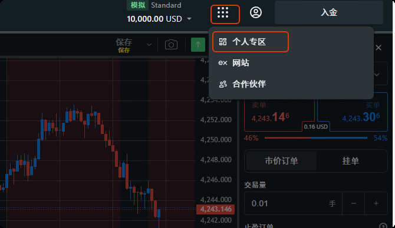
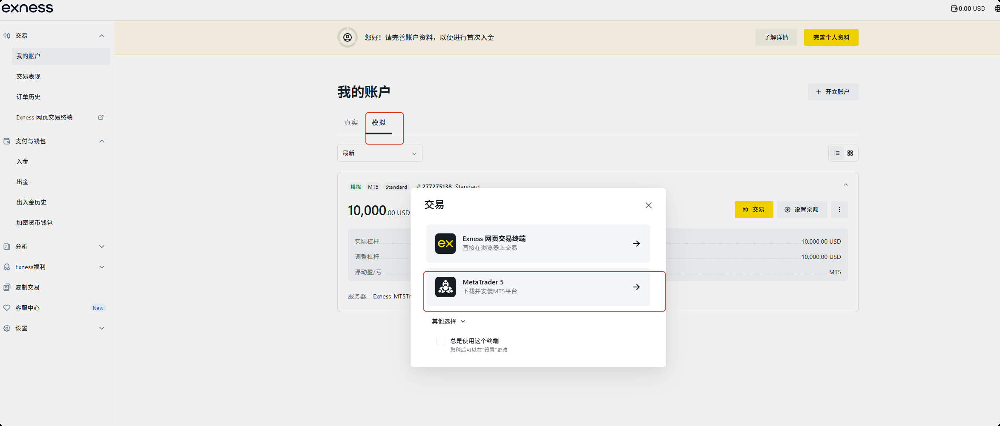

# EasyDeal MT5 智能交易系统

## 项目概述

就算有一套完全自动赚钱的工具，你也会经常盯着它。你跟专业交易员对比，差别在于是否看得懂。而EasyDeal 就是解决这个问题的一套框架，提供一组MCP工具，接入 openclaw、Claude Code, Fay等agent后，在MT5交易环境可以协同各种策略工作，监控策略的执行、为你解答各种问题、指导你做出突发处理，甚至直接帮你修改策略代码。

- **核心交易端 (EA)**: 由 `GMarket.mq5` (也可以替换成自己的，或者**进群**获取更多)负责，直接在 MT5 终端运行。它执行核心的交易逻辑（双向开仓、马丁格尔策略、风险控制）、提供图形化操作界面 (UI)，并内置了财经日历新闻过滤功能。
- **智能监控端 (MCP Server)**: 由 `easydeal_mcp_server.py` 负责。它作为 AI Agent (如 openclaw、Claude Code, Fay) 的连接器，通过 MCP 协议提供实时的策略状态监控、异常告警、日志分析及一致性校验功能。

这种架构确保了交易的稳定性（EA 独立运行，不受 Python 端影响），同时赋予了系统强大的 AI 扩展能力（通过 MCP 进行自然语言交互和智能风控）。

## 主要特点

### 核心策略 (EA、可更换)

- **双向对冲策略**：同时捕捉多空机会，顺势爬梯止盈，逆势马丁解套。
- **智能风控**：
  - **新闻过滤**：自动读取财经日历，在重大数据（如非农、利率决议）发布前后暂停加仓。
  - **技术指标过滤**：结合 ATR 波动率和布林带偏离度，避免在极端行情下盲目加仓。
  - **最大回撤保护**：设定最大浮亏金额，触及阈值自动清仓止损。
- **图形化控制面板 (UI)**：
  - 实时显示马丁层级、交易方向、ATR/布林带状态及当前盈利。
  - 快捷按钮：一键暂停策略、开关马丁功能、强制重载状态。
- **断点续传**：EA 具备自动状态恢复功能，重启 MT5 后可自动识别并接管已有订单。

### 智能监控 (MCP Server)

- **AI Agent 集成**：支持通过 MCP 协议接入 Claude Desktop 或 Fay 数字人，实现"对话式"交易监控。
- **全方位告警**：
  - **状态异常**：EA 停止运行、终端掉线通知。
  - **风险预警**：浮亏比例预警 (30%/50%/70%)、马丁层级过高预警。
  - **技术信号**：RSI 超买超卖、MACD 金叉死叉提示。
- **一致性校验**：每日自动比对 EA 交易日志与策略规则，生成执行合规性报告。
- **Web API**：提供 HTTP 接口供其他系统调用。
- **主动修改策略及参数**：若agent需要执行此类操作，通常会先获得主人的允许，代码修改前也先会备份，你也可以让agent恢复过往的版本。（注：目前已经的问题是，修改的代码经常需要人工编译，但大模型常常会认为已经完成了编译工作）

# 联系我们


注：群满加 qq467665317

---

# 一、交易账号注册与MT5安装

- 访问 exness 官网（需要开启 VPN，VPN 不能使用美国、伊朗、朝鲜、欧盟、英国）：https://one.exnessonelink.com/a/r6fx3vgje1

- 点击右上角登录 --> 开立账户 --> 注册 --> 个人专区
  
  - 

- 我的账户 --> 模拟 --> 交易 --> Meta Trader 5（此处保存好交易账号信息及服务器信息）--> 下载安装 MT5 平台 --> 运行 exness5setup.exe --> 等待安装完成
  
  - 
  - 

- 运行 MT5 终端 --> 关闭开设账户弹窗 --> 导航栏 --> exness --> 账户 -- 右键 --> 登录到交易账户（注意，此处填写的登录名为上文选择 mt5 交易时记录的那串数字账号，服务器也需注意选择正确）

---

# 二、MT5开启算法交易


## 前置条件

开始算法交易之前，请确定已经完成MT5的安装及交易账号的注册。

## 下载mql5源码

首先到网站https://gitee.com/xszyou/easy-deal 下载GMarket.mq5代码文件。

```
https://gitee.com/xszyou/easy-deal
```

## 编译mql5源码


点击MT5上面菜单栏的文件，选择“打开数据文件夹”，的把刚刚下载的源码文件放到 MQL5\Experts目录下，并双击，此时应该看到如图所示的编辑器。在编辑器上点一下上方的“编写”即完成代码的编译工作。

## 打开交易窗口


此时关闭编辑器，回到MT5，右键点击交易品种“XAUUSD”，选择“图表窗口”，即打开了如图所示图表。

## 附加EA开启算法交易


此时，到导航栏，找到刚才编译的EA，双击附加到图表。附加的时候要注意勾选允许算法交易。确定后，点击上方的算法交易按钮，让算法交易开启起来。成功后你应该能够看到类似作者的窗口交易。注意，在非交易日，一般是节假日，没有行情报价从交易所过来，ea是不会运作的，也不会出现左下角的信息窗和右下角的按钮，附加ea后，等待交易时间到来即可。
---

# 

---

# 三、easydea fay版搭建教程


## 前置条件


启动MT5，登录到交易服务器，附加ea到xausd的图表并开启算法交易。

## 安装fay


首先请到以下网址下载并在宿主机安装fay。在windows系统上安装。

```
https://qqk9ntwbcit.feishu.cn/wiki/V5qcwlikKiehoYkAPhYcmBPAnAc
```

## 配置easydeal mcp服务


我们打开fay的管理页面，进入mcp栏，依图添加easy deal的mcp服务，easy deal的源码地址也给你们贴出来了，请提前下载并安装好python环境及依赖。

```
https://gitee.com/xszyou/easy-deal
```

## mcp启动及验证


在fay这里添加好mcp服务后，需要点击连接，等待连接上easy deal的mcp服务器，咱们就可以到fay的聊天页面测试easy deal了。在这之前大家记得启动好mt5,并把算法交易启动。

## 找出策略的问题


我们可以让fay去找到策略的问题，并完成修改。

## 分析总结情况


我们可以让fay去分析运行情况，并做进一步的优化。

---

# 四、easydeal小龙虾版搭建教程


## 前置条件


启动MT5，登录到交易服务器，附加ea到xausd的图表并开启算法交易。

## 安装wsl


首先到windows系统自带的microsoft store搜索并安装ubuntu 24.04。

```
首先到windows系统自带的microsoft store搜索并安装ubuntu 24.04。
```

## 启动wsl


接着通过powsell启动wsl

```
接着通过powsell启动wsl
```

## 给wsl配置代理


宿主机器通过内网为wsl提供代理服务，这里注意宿主机的内网网卡是这个带wsl标识的虚拟网卡。

```
宿主机器通过内网为wsl提供代理服务，这里注意宿主机的内网网卡是这个带wsl标识的虚拟网卡。如果vpn还没有生效可以通过以下指令在powershell上执行以更改防火墙到wsl的拦截：
New-NetFirewallRule -DisplayName "WSL Proxy 7890" -Direction Inbound -LocalPort 7890 -Protocol TCP -Action Allow
```

## wsl上安装nodejs

在wsl中输入以下命令，完成nodejs的安装

```
1. 更新系统
sudo apt update && sudo apt upgrade -y
2. 安装 Node.js 22
执行以下命令安装 Node.js 22： CoClaw
curl -fsSL https://deb.nodesource.com/setup_22.x | sudo -E bash -
sudo apt-get install -y nodejs
3. 验证安装
node --version   # 应显示 v22.x
npm --version
```

## 安装openclaw

在wsl终端上继续输入以下命令完成openclaw的安装

```
npm install -g openclaw@latest
```

## 安装微信通道

请在终端上输入以下命令以安装微信插件。如果安装时出现“Rate limit exceeded”，那是因为安装的人太多，可以等几分钟再试，又或者到github下载源码安装。

```
openclaw plugins install "@tencent-weixin/openclaw-weixin"
```

## 启用微信插件

在控制台输入如下命令启用微信插件并重启网关。

```
openclaw config set plugins.entries.openclaw-weixin.enabled true  #启用微信插件

openclaw gateway restart  #重启网关
```

## 微信扫码登录


输入如下命令后微信扫码登录，请放心，此插件为腾讯官方插件，不会封号的。

```
openclaw channels login --channel openclaw-weixin
```

## openclaw配置


在wsl终端上输入以下命令回车后开始配置openclaw

```
nano ~/.openclaw/openclaw.json
```

## openclaw配置：llm


参考如下代码完成agents部分的修改。以及在json第1级下增加models，这里要注意修改base url为你宿主机的ip，这个ip咱们之前配置vpn里已经教过怎么获取了。

```
agents部分：
"agents": {
    "defaults": {
      "model": {
        "primary": "fay/llm"
      },
      "models": {
        "fay/llm": {
          "alias": "fay llm"
        }
      },
      "workspace": "/root/.openclaw/workspace"
    }
  }

models部分：
"models": {
  "mode": "merge",
  "providers": {
    "fay": {
      "baseUrl": "http://172.23.48.1:5000/v1",
      "apiKey": "sk-fay",
      "api": "openai-completions",
      "models": [
        {
          "id": "llm",
          "name": "Fay LLM"
        }
      ]
    }
  }
}
```

## openclaw常用命令


至此，openclaw的配置引导已经完成了，以下是openclaw常用的操作命令。

```
openclaw update            #升级
openclaw gateway start     # 启动
openclaw gateway stop      # 停止
openclaw gateway restart   # 重启
openclaw gateway status    # 查看状态
openclaw tui               # 打开终端聊天界面
openclaw dashboard         # 打开 Web 控制台
openclaw status            # 查看运行状态
openclaw configure         # 重新进入交互式配置向导
openclaw models list       # 查看可用模型列表
```

## 修改llm配置：安装fay


首先请到以下网址下载并在宿主机安装fay。在windows系统上安装。

```
https://qqk9ntwbcit.feishu.cn/wiki/V5qcwlikKiehoYkAPhYcmBPAnAc
```

## 验证配置


使用以下命令重启openclaw，打开webui,并复制连接到宿主机访问测试

```
openclaw gateway restart   # 重启
openclaw dashboard         # 打开 Web 控制台
```

## 配置easydeal mcp服务


我们打开fay的管理页面，进入mcp栏，依图添加easy deal的mcp服务，easy deal的源码地址也给你们贴出来了，请提前下载并安装好python环境及依赖。

```
https://gitee.com/xszyou/easy-deal
```

## mcp启动及验证


在fay这里添加好mcp服务后，需要点击连接，等待连接上easy deal的mcp服务器，咱们就可以到fay的聊天页面测试easy deal了。在这之前大家记得启动好mt5,并把算法交易启动。

## openclaw配置mcp服务


确定fay连通了easy deal后，openclaw就可以借助fay与mt5通讯了。接下来我们需要在wsl终端上给openclaw配置mcp服务。请输入以下命令完成配置。这里注意，请把ip替换成宿主机ip。

```
openclaw mcp set faymcp '{"url":"http://172.23.48.1:8765/sse"}'  #添加mcp服务
openclaw gateway restart #重启
openclaw mcp show faymcp #检查mcp服务配置
openclaw mcp unset faymcp #删除mcp服务
```

## 创建agent


请通过以下指令创建量化交易相关的agent。其中forex-commander 是交易指挥官，是主 Agent，负责接收所有渠道消息，分类意图，调度子 Agent 执行，汇总结果回复用户。ea-supervisor是EA 监管员，负责监控 MT5 EA 运行状态，检查持仓、账户、交易历史，发现异常主动报告。strategy-analyst是策略分析师，负责分析交易历史数据，评估 EA 策略表现，给出优化建议。risk-guard是风控员，负责检查账户风险敞口、保证金率、单币对集中度，超阈值时报警。

```
openclaw agents add forex-commander --workspace ~/.openclaw/workspaces/forex-commander --non-interactive
openclaw agents add ea-supervisor --workspace ~/.openclaw/workspaces/ea-supervisor --non-interactive
openclaw agents add strategy-analyst --workspace ~/.openclaw/workspaces/strategy-analyst --non-interactive
openclaw agents add risk-guard --workspace ~/.openclaw/workspaces/risk-guard --non-interactive
```

## 定义agent


请在easy deal 仓库里找到openclaw-agent目录，把里面的文件替换到 ~/.openclaw/workspaces 对应的目录，注意，只需要做文件替换，不需要删除已经存在的文件。

## openclaw.conf中修改agent配置


请编辑openclaw.conf完成图上这些agent配置，完成配置文件参考我也放在了easydeal仓库了。

## 修改bindings、tools和cron配置


同样参考图例完成config文件的修改。

## 完成配置


至此，所有配置已经完成，你已经可以和小龙虾去共同完善你的交易策略了，同时也监控着你策略的风险。

---

# 五、easydeal claude code版搭建教程


## 前置条件


启动MT5，登录到交易服务器，附加ea到xausd的图表并开启算法交易。

## 安装fay


首先请到以下网址下载并在宿主机安装fay。在windows系统上安装。

```
https://qqk9ntwbcit.feishu.cn/wiki/V5qcwlikKiehoYkAPhYcmBPAnAc
```

## 配置easydeal mcp服务


我们打开fay的管理页面，进入mcp栏，依图添加easy deal的mcp服务，easy deal的源码地址也给你们贴出来了，请提前下载并安装好python环境及依赖。

```
https://gitee.com/xszyou/easy-deal
```

## mcp启动及验证


在fay这里添加好mcp服务后，需要点击连接，等待连接上easy deal的mcp服务器，咱们就可以到fay的聊天页面测试easy deal了。在这之前大家记得启动好mt5,并把算法交易启动。

## cladue code连接mcp服务


启动claude code cli后，在claude code上输入“请连接以下mcp服务 ： [http://127.0.0.1:8765/sse”，回车等待连接成功。](http://127.0.0.1:8765/sse%E2%80%9D%EF%BC%8C%E5%9B%9E%E8%BD%A6%E7%AD%89%E5%BE%85%E8%BF%9E%E6%8E%A5%E6%88%90%E5%8A%9F%E3%80%82)

## 测试easydeal


连接成功后，重启claude code cli， 并输入“请结合mt5上的日志分析一下策略的执行情况”。
！！！注意控制好claude code的权限边界，特别是代码的修改让claude code通过mcp工具去完成。

---

# 六、MCP 服务器环境变量

`easydeal_mcp_server.py` 支持通过环境变量覆盖默认配置。所有变量均为可选，未设置时使用表中的默认值。

## 监控与 EA 识别

| 变量名                   | 默认值                                 | 作用                                                                              |
| --------------------- | ----------------------------------- | ------------------------------------------------------------------------------- |
| `EA_PROFILE_PATH`     | `monitor_profile.json`（脚本目录）        | 监控配置 JSON 文件路径，用于持久化 symbols/magic_numbers/max_loss 等设置                         |
| `EA_SET_PATH`         | `../config.set`（相对脚本目录）             | EA 的 `.set` 参数文件路径；加载失败时会自动回退到 MT5 chart profile 或 EA 源码默认值                     |
| `EA_SYMBOLS`          | `GOLD,GOLD#,XAUUSD,XAUUSDm,XAUUSDc` | 监控的交易品种白名单（逗号或分号分隔）                                                             |
| `EA_MAGIC_NUMBERS`    | `999`（由 profile 默认值提供）              | 监控的 magic number 列表（逗号或分号分隔）                                                    |
| `EA_MAGIC_NUMBER`     | 未设置                                 | 单个 magic number；仅当 `EA_MAGIC_NUMBERS` 未设置时生效                                    |
| `EA_MAX_LOSS`         | `3000`                              | 最大浮亏金额告警阈值（账户货币）                                                                |
| `EA_COMMENT_CONTAINS` | 空                                   | 订单备注白名单关键字（逗号或分号分隔），只监控备注包含其中任意关键字的持仓                                           |
| `EA_COMMENT_EXCLUDES` | 空                                   | 订单备注黑名单关键字，备注命中任意关键字的持仓将被忽略                                                     |
| `EA_FILE_PATH`        | 未设置                                 | EA 源码 `.mq5` 完整路径覆盖；未设置时依次尝试 MT5 chart profile 自动识别、`MQL5/Experts/` 目录递归查找、脚本目录 |
| `EA_FILENAME`         | `GMarket.mq5`                       | EA 源码文件名，自动搜索时使用                                                                |
| `METAEDITOR_PATH`     | 从 MT5 安装目录自动检测                      | `MetaEditor64.exe` 完整路径，用于编译 EA                                                 |

## 策略文档与对话上下文

| 变量名                    | 默认值                            | 作用                                                |
| ---------------------- | ------------------------------ | ------------------------------------------------- |
| `EA_STRATEGY_DOC_PATH` | `strategy_doc_latest.md`（脚本目录） | 策略说明文档路径，一致性校验读取的基线文档                             |
| `EA_CONVERSATION_PATH` | 未设置                            | 对话历史日志路径；未设置时从 `logs/easydeal.log` 中提取工具调用记录作为上下文 |

## Fay 集成

| 变量名               | 默认值                                         | 作用                             |
| ----------------- | ------------------------------------------- | ------------------------------ |
| `FAY_MSG_API_URL` | `http://127.0.0.1:5000/api/get-msg`         | 拉取 Fay 聊天历史的接口地址               |
| `FAY_API_URL`     | `http://127.0.0.1:5000/v1/chat/completions` | Fay LLM 对话接口（OpenAI 兼容）        |
| `FAY_API_KEY`     | `YOUR_API_KEY`                              | Fay 接口鉴权 Key（LLM 查询与告警回调共用）    |
| `FAY_MODEL`       | LLM 查询：`llm`；告警回调：`fay-streaming`           | Fay 使用的模型名；两个场景共用同一环境变量，但默认值不同 |
| `FAY_MSG_LIMIT`   | `200`                                       | 拉取 Fay 聊天历史时的最大条数              |
| `FAY_NOTIFY_URL`  | `http://127.0.0.1:5000/transparent-pass`    | 告警/观察信息透传到 Fay 的接口地址           |
| `FAY_ROLE`        | `monitor`                                   | 告警回调携带的角色标识                    |
| `FAY_NOTIFY_USER` | `User`                                      | 告警透传时使用的用户名                    |

# 许可证

本项目采用 GLP 3.0 许可证。


