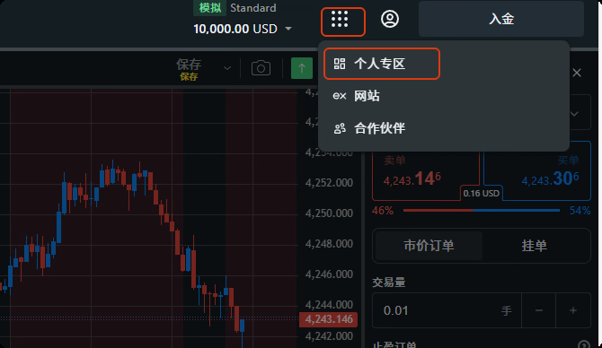
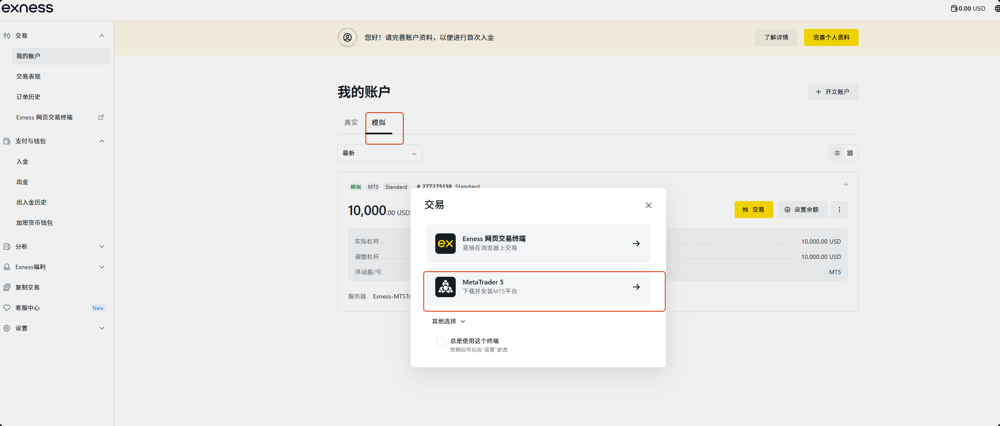
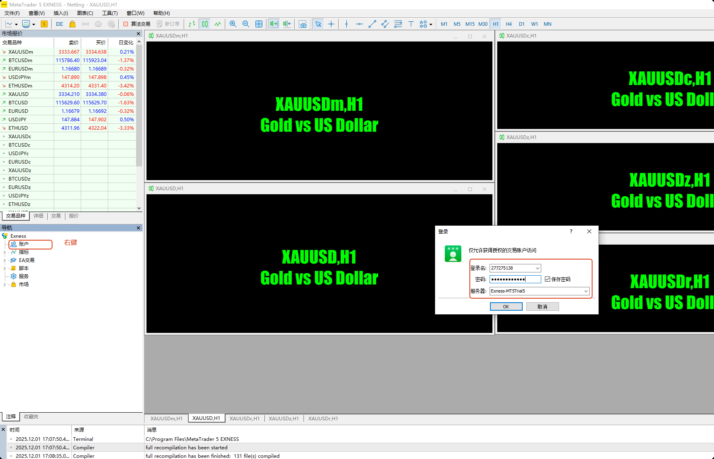
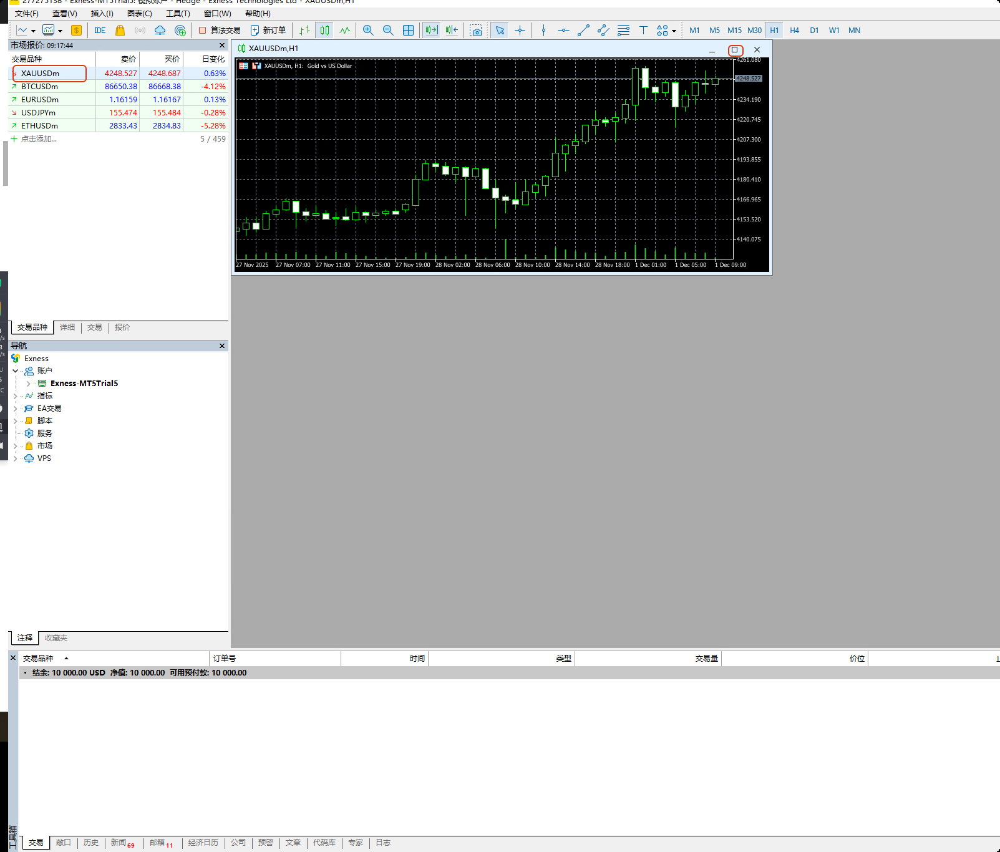
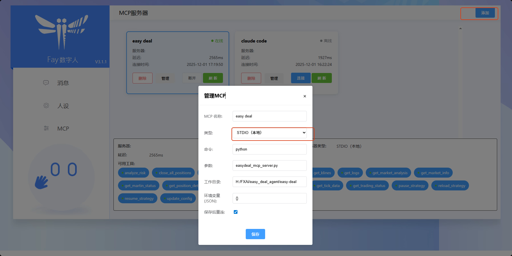

# EasyDeal MT5 交易策略

## 策略概述

EasyDeal MT5是一个基于MetaTrader 5平台的自动化交易策略，支持 AI Agent 通过 MCP 协议接入进行智能交易管理。

策略会双向开仓入场，在顺势方向执行爬梯止盈并开新单，在逆势方向会不断开马丁单，直至逆势方向的订单不亏损完结。在第一次爬梯后会锁定方向。开马丁时会同时开一张同向基础单，马丁单的大小为上一次马丁单和基础单加起来的两倍。马丁单受控于两个参数，马丁最小矩离和滤波矩离，上一张逆向单必须达到马丁矩离并回撤达到滤波矩离才会增开马丁单。马丁单结束时会补开一张基础单，形成新一轮双单起步，如此不断循环。在执行的图形变化上会出现，双单锁定的区间由小变大，再突然变窄。在资金方面，在绝对安全的情况下先把浮亏转换成盈利，再通过马丁单去结束浮亏，浮亏转换效率93%以上，风险位在于马丁。很多人对马丁有意见，但其实跑赢概率还是得马丁，只是如果以马丁来做营收，冲着马丁去落单，总会遇到极端情况。这个策略就是反过来的，常态化用浮亏换收益，摘机再用马丁去收浮亏。


## 作者故事

17年上半年我带队做了一个币交易所，往后是钱包、o2c、合约等配套工具。20年后业余时间帮多个资管公司编写外汇交易ea，主业是ai开发，至今一直在打造数字人开源项目 https://github.com/xszyou/fay 。最近老想把数字人（更多是指agent），与ea相结合，故挑选了一套简洁的策略作为demo，给大家开源出来。


## 主要特点

- **双向开仓**：同时开立买单和卖单，捕捉市场双向机会
- **马丁格尔策略**：合适的时机使用马丁来收窄锁定区间，降低浮亏
- **风险控制**：设置最大亏损限制和最大马丁层数，防止过度亏损
- **Web API接口**：提供完整的REST API，可远程监控和控制策略
- **MCP Server**：支持 AI Agent 接入，实现智能化交易管理
- **监控告警**：内置监控服务，支持 MACD/RSI/ATR/布林带 等技术指标告警
- **日志记录**：详细记录交易和API请求，便于回测和分析
- **复盘回测：**联系客服获取ea程序使用MT自带复盘功能进行回测

## 项目文件

```
easy-deal/
├── easydeal_mt5.py          # 主策略文件 + Flask API
├── easydeal_mcp_server.py   # MCP Server (AI Agent 接入)
├── easydeal_monitor.py      # 监控服务 (告警/Webhook)
├── mcp_config.json          # MCP 客户端配置示例
├── requirements.txt         # Python 依赖
├── README.md                # 项目文档
└── logs/                    # 日志目录
    ├── easydeal.log         # 策略运行日志
    ├── api_requests.log     # API请求日志
    ├── mcp_server.log       # MCP服务日志
    └── monitor_events.jsonl # 监控事件日志
```

## 安装要求

- Python 3.8+
- MetaTrader 5平台及其Python API
- Windows 操作系统（MT5 限制）

### 安装依赖

```bash
pip install -r requirements.txt
```

或手动安装：

```bash
pip install MetaTrader5 pandas flask pytz mcp requests
```

## 使用流程

### 1. 准备工作

- 开户及下载MT5（本文以exness为例）

  - 访问exness官网（可能需要vpn，vpn不能使用美国、伊朗、朝鲜、欧盟、英国）：https://one.exnessonelink.com/a/r6fx3vgje1
  - 点击右上角登录-->开立账户-->注册-->个人专区
    - 

  - 我的账户-->模拟-->交易-->Meta Trader 5（此处保存好交易账号信息及服务器信息）-->下载安装MT5平台-->运行exness5setup.exe-->等待安装完成
    - 
    - 

  - 运行MT5终端-->关闭开设账户弹窗-->导航栏-->exness-->账户--右健-->登录到交易账户（注意，此处填写的登录名为上文选择mt5交易时记录的那串数字账号，服务器也需注意选择正确）
    - 
    - 主窗口交闭除XAUUSDm,H1 外的其他窗口，并全屏。（若关多了，可以在左则交易品种右键重新打开交易窗口）
      - 

  - 选择XAUUSDm窗口

  

### 2. 配置参数

在`easydeal_mt5.py`文件中，通过修改`EasyDealStrategy`类的`__init__`方法来配置交易参数：

```python
def __init__(self):
    # 直接设置交易参数
    self.symbol = "XAUUSDm"  # 交易币对
    self.first_lots = 0.01  # 首单手数
    self.step = 0.1  # 步长
    self.martin_interval = 1.6  # 马丁间隔
    self.filter = 0.1  # 过滤百分比
    self.order_time = 0  # 下单时间
    self.magic_number = 999  # 魔术数字
    self.max_loss = 3000  # 最大亏损
    self.max_martin_level = 5  # 最大马丁层数
```

### 3. 启动策略

运行以下命令启动策略：

```bash
python easydeal_mt5.py
```

启动后，策略将自动连接到MetaTrader 5平台，并开始监听8888端口的HTTP请求。
需确保脚本运行机器和MetaTrader 5平台所在机器是同一台，并且已经打开了币对的交易窗口。


### 4. 启动监控

运行以下命令启动策略：

```bash
python easydeal_monitor.py
```

启动后，策略将自动监测风险情况。（下文详述）


### 5. 启动agent

1、依照https://github.com/xszyou/fay安装并运行fay(记得star哦)


2、在fay 界面配置上mcp服务器并连接




## 参数配置说明

| 参数名 | 说明 | 默认值 | 建议范围 |
|--------|------|--------|----------|
| symbol | 交易币对 | EURUSD | 任何MT5支持的币对 |
| first_lots | 首单手数 | 0.01 | 0.01-1.0 |
| step | 马丁加仓步长 | 0.1 | 0.1-0.5 |
| martin_interval | 马丁间隔（点数） | 1.6 | 1.0-5.0 |
| filter | 过滤百分比 | 0.1 | 0.05-0.2 |
| order_time | 下单时间（0表示立即下单） | 0 | 0或Unix时间戳 |
| magic_number | 魔术数字（订单标识） | 999 | 任意整数 |
| max_loss | 最大亏损限制（美元） | 3000 | 根据资金量设置 |
| max_martin_level | 最大马丁层数 | 5 | 3-10 |


## Web API接口说明

策略通过Flask提供以下REST API接口，默认监听端口为8888：

### 1. 获取策略状态

```
GET /status
```

返回当前策略状态，包括市场数据、策略状态和订单信息。

### 2. 暂停策略

```
GET /pause
```

暂停策略运行，策略将停止检查开仓和加仓条件，但不会关闭现有订单。

### 3. 恢复策略

```
GET /resume
```

恢复策略运行。

### 4. 重新加载策略

```
GET /reload
```

重新加载策略，会重新初始化所有参数。

### 5. 关闭所有订单

```
GET /close_all
```

关闭当前所有开仓的订单。

### 6. 获取当前盈亏

```
GET /profit
```

获取当前所有订单的总盈亏。

### 7. 获取配置信息

```
GET /config
```

获取当前策略的配置参数。

### 8. 获取日志

```
GET /logs
```

获取策略运行日志。


## MCP Server (AI Agent 接入)

EasyDeal 提供了 MCP (Model Context Protocol) 服务器，允许 AI Agent 直接与交易策略进行交互。

### 安装 MCP 依赖

```bash
pip install mcp
```

### 配置 MCP Server

将以下配置添加到你的 Fay、Claude Desktop 或其他 MCP 客户端配置中：

```json
{
  "mcpServers": {
    "easydeal-trading": {
      "command": "python",
      "args": ["D:\\Projects\\easy_deal_agent\\easy-deal\\easydeal_mcp_server.py"]
    }
  }
}
```

### MCP 工具列表

#### 策略控制工具

| 工具名称 | 描述 | 参数 |
|---------|------|------|
| `get_trading_status` | 获取当前交易策略的完整状态 | 无 |
| `get_config` | 获取策略配置参数 | 无 |
| `pause_strategy` | 暂停交易策略 | 无 |
| `resume_strategy` | 恢复交易策略 | 无 |
| `close_all_positions` | 平掉所有持仓 | `confirm`: bool (必须为true才执行) |
| `get_profit_history` | 获取收益历史 | `days`: int (默认30) |
| `get_logs` | 获取策略日志 | `lines`: int (默认100)<br>`level`: ALL/INFO/WARNING/ERROR<br>`log_type`: all/main/api |
| `reload_strategy` | 重新加载策略 | 无 |
| `analyze_risk` | 分析当前风险状况 | 无 |
| `get_position_details` | 获取持仓详情 | 无 |
| `update_config` | 更新策略参数 | `max_loss`: float<br>`max_martin_level`: int<br>`step`: float<br>`martin_interval`: float<br>`filter`: float |

#### 马丁控制工具

| 工具名称 | 描述 | 参数 |
|---------|------|------|
| `get_martin_status` | 获取马丁状态、波动率指标 | 无 |
| `enable_martin` | 启用马丁加仓功能 | 无 |
| `disable_martin` | 禁用马丁加仓功能 | `reason`: string (禁用原因，可选) |
| `update_martin_config` | 更新马丁控制参数 | `max_atr_pct`: float (ATR阈值)<br>`max_boll_deviation`: float (布林带偏离阈值) |

#### 行情分析工具

| 工具名称 | 描述 | 参数 |
|---------|------|------|
| `get_market_info` | 获取实时行情（Bid/Ask/Spread） | - |
| `get_klines` | 获取K线数据 | `timeframe`: M1/M5/M15/M30/H1/H4/D1/W1/MN1<br>`count`: 数量(最大1000) |
| `get_technical_indicators` | 获取技术指标 | `timeframe`: 时间周期<br>`indicators`: MA/EMA/RSI/MACD/BOLL/ATR/STOCH |
| `get_market_analysis` | 综合市场分析 | `timeframe`: M15/H1/H4/D1 |
| `get_tick_data` | 获取Tick逐笔数据 | `count`: 数量(最大1000) |

#### 技术指标说明

| 指标 | 返回内容 |
|------|----------|
| **MA** | MA5/10/20/60 均线 + 趋势判断 |
| **EMA** | EMA12/26 指数均线 |
| **RSI** | RSI14 + 超买/超卖信号 |
| **MACD** | MACD线/信号线/柱状图 + 金叉死叉判断 |
| **BOLL** | 布林带上轨/中轨/下轨 + 带宽 + 价格位置 |
| **ATR** | ATR14 真实波幅 + 波动率等级 |
| **STOCH** | 随机指标K/D值 + 交易信号 |

#### 市场分析返回示例

```json
{
  "trend": { "overall": "看涨/看跌/震荡", "signals": ["MA金叉", "价格在MA20上方"] },
  "momentum": { "rsi": 55.2, "rsi_signal": "偏强", "macd": 0.5 },
  "support_resistance": { "resistance1": 2050.5, "support1": 2020.3 },
  "volatility": { "atr": 15.5, "atr_pct": 0.75, "level": "中" },
  "recommendation": { "bias": "看涨", "confidence": "中", "notes": ["无特殊信号"] }
}
```

### MCP 资源

| 资源 URI | 说明 |
|----------|------|
| `trading://status` | 实时交易状态 |
| `trading://config` | 策略配置 |
| `trading://positions` | 持仓信息 |
| `trading://strategy-doc` | 策略逻辑文档（推荐Agent先读取理解策略） |
| `trading://strategy-code` | 策略完整源代码（敏感，按需使用） |

### MCP 提示模板

- `analyze_trading_situation` - 分析当前交易状况
- `risk_assessment` - 风险评估
- `daily_report` - 每日交易报告
- `emergency_response` - 紧急情况响应

### 使用示例

AI Agent 可以通过 MCP 协议执行以下操作：

1. **监控交易状态**：定期获取策略状态和持仓信息
2. **风险管理**：分析风险并在必要时暂停策略
3. **生成报告**：自动生成每日交易报告
4. **参数调整**：根据市场情况动态调整策略参数
5. **紧急响应**：在风险过高时自动执行保护措施

### Agent 触发时机

#### 定时触发（周期性）

| 场景 | 建议频率 | 使用工具 |
|------|----------|----------|
| 状态监控 | 每1分钟 | `get_trading_status` |
| 风险检查 | 每1-5分钟 | `analyze_risk` |
| 行情分析 | 每5-15分钟 | `get_market_analysis` |
| 日报生成 | 每日收盘 | `daily_report` prompt |

#### 事件触发（条件满足时）

| 触发条件 | 建议动作 |
|---------|----------|
| 浮亏超过30% | 发送告警，密切关注 |
| 浮亏超过50% | `analyze_risk` + 考虑 `pause_strategy` |
| 浮亏超过70% | 紧急告警，可能需要 `close_all_positions` |
| 马丁层级 >= 3 | 发送告警，关注市场走势 |
| RSI超买/超卖 | `get_market_analysis` 评估风险 |
| 策略异常停止 | `reload_strategy` 尝试恢复 |


## 监控服务

除了 MCP Server，还提供了独立的监控服务 `easydeal_monitor.py`，支持：

- **定时检查**：自动检查风险、市场、策略状态
- **阈值告警**：浮亏、马丁层级、RSI等触发告警
- **Webhook回调**：事件推送到外部系统
- **文件记录**：事件日志持久化

### 启动监控服务

```bash
python easydeal_monitor.py
```

### 告警阈值配置

```python
config = {
    # 风险告警
    "loss_warning_pct": 30,      # 浮亏30%警告
    "loss_danger_pct": 50,       # 浮亏50%危险
    "loss_critical_pct": 70,     # 浮亏70%紧急
    "martin_warning_level": 2,   # 马丁2层警告
    "martin_danger_level": 3,    # 马丁3层危险

    # 技术指标告警
    "rsi_overbought": 70,        # RSI超买
    "rsi_oversold": 30,          # RSI超卖
    "volatility_high_pct": 1.5,  # 高波动率阈值

    # MACD告警
    "macd_cross_alert": True,              # 金叉死叉告警
    "macd_divergence_alert": True,         # 背离告警
    "macd_zero_cross_alert": True,         # 零轴穿越告警
    "macd_histogram_reversal_bars": 3,     # 柱状图反转告警
}
```

### MACD 告警类型

| 告警类型 | 级别 | 说明 |
|---------|------|------|
| `macd_golden_cross` | info/warning | 金叉信号（零轴上方更强） |
| `macd_death_cross` | warning/danger | 死叉信号（零轴下方更危险） |
| `macd_zero_cross_up` | info | MACD上穿零轴，趋势转多 |
| `macd_zero_cross_down` | warning | MACD下穿零轴，趋势转空 |
| `macd_histogram_bullish_reversal` | info | 柱状图由减转增，下跌动能减弱 |
| `macd_histogram_bearish_reversal` | warning | 柱状图由增转减，上涨动能减弱 |
| `macd_bullish_divergence` | info | 底背离，可能见底 |
| `macd_bearish_divergence` | danger | 顶背离，可能见顶 |

### 全部告警类型汇总

| 类别 | 告警类型 | 级别 | 说明 |
|------|---------|------|------|
| **风险** | `risk_loss` | warning/danger/critical | 浮亏达到30%/50%/70% |
| | `risk_martin` | warning/danger/critical | 马丁层级达到2/3/4层 |
| **RSI** | `market_rsi` | warning | RSI超买(>70)或超卖(<30) |
| **波动率** | `market_volatility` | warning | ATR%超过阈值 |
| **马丁控制** | `martin_control` | warning | 建议禁用马丁（高波动/趋势行情） |
| **MACD** | `macd_golden_cross` | info/warning | 金叉信号 |
| | `macd_death_cross` | warning/danger | 死叉信号 |
| | `macd_zero_cross_up` | info | 上穿零轴 |
| | `macd_zero_cross_down` | warning | 下穿零轴 |
| | `macd_histogram_bullish_reversal` | info | 柱状图转增 |
| | `macd_histogram_bearish_reversal` | warning | 柱状图转减 |
| | `macd_bullish_divergence` | info | 底背离 |
| | `macd_bearish_divergence` | danger | 顶背离 |
| **状态** | `status` | info/critical | 策略暂停/停止 |


## 架构图

```
┌─────────────────────────────────────────────────────────────────┐
│                         用户/AI Agent                            │
└───────────────────────────────┬─────────────────────────────────┘
                                │
            ┌───────────────────┼───────────────────┐
            │                   │                   │
            ▼                   ▼                   ▼
    ┌───────────────┐   ┌───────────────┐   ┌───────────────┐
    │  Flask API    │   │  MCP Server   │   │   Monitor     │
    │  :8888        │   │  (stdio)      │   │   Service     │
    └───────┬───────┘   └───────┬───────┘   └───────┬───────┘
            │                   │                   │
            └───────────────────┼───────────────────┘
                                │
                                ▼
                    ┌───────────────────────┐
                    │  EasyDealStrategy     │
                    │  (核心交易逻辑)         │
                    └───────────┬───────────┘
                                │
                                ▼
                    ┌───────────────────────┐
                    │    MetaTrader 5       │
                    │    (交易执行)          │
                    └───────────────────────┘
```


## 联系我们


注：群满加qq467665317

## 许可证

本项目采用GLP 3.0许可证。详情请参阅LICENSE文件。
